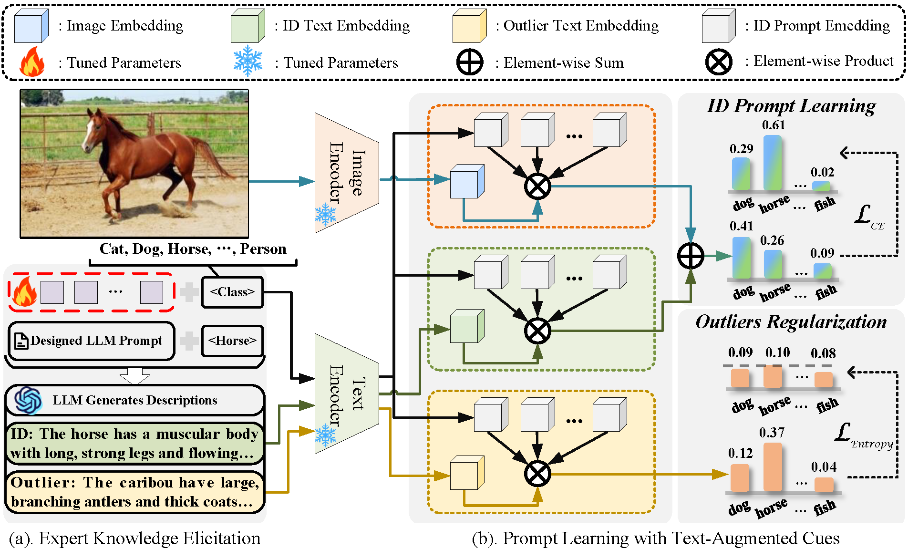

# TAC
Beyond Vision: Prompt Learning with Text-Augmented Cues for Out-of-Distribution Detection

## Installation
The project is based on PyTorch.
Below are quick steps for installation:
```shell
conda create -n open-mmlab python=3.8 pytorch==1.10 torchvision==0.11.2 cudatoolkit=11.3 -c pytorch -y
conda activate open-mmlab
pip install openmim
mim install -e .
pip install ftfy regex tqdm
pip install git+https://github.com/openai/CLIP.git
```
## Dataset Preparation
### In-distribution dataset

Please download [ImageNet-1k](http://www.image-net.org/challenges/LSVRC/2012/index) and place the training data (not necessary) and validation data in
`./data/id_data/imagenet_train` and  `./data/id_data/imagenet_val`, respectively.

### Out-of-distribution dataset

We use the following 4 OOD datasets for evaluation: [iNaturalist](https://arxiv.org/pdf/1707.06642.pdf), [SUN](https://vision.princeton.edu/projects/2010/SUN/paper.pdf), [Places](http://places2.csail.mit.edu/PAMI_places.pdf), and [Textures](https://arxiv.org/pdf/1311.3618.pdf).

Please refer to [MOS](https://github.com/deeplearning-wisc/large_scale_ood), download OOD datasets and put them into `./data/ood_data/`.

### Generation classes names and description

Use following codes to generate both ood classes and describtion.
```shell
torchrun --nproc_per_node 1 ask_llama_to_generate.py \
    --ckpt_dir llama-2-7b-chat/ \
    --tokenizer_path tokenizer.model \
    --max_seq_len 512 --max_batch_size 4
```
 You should download llama-2-7b checkpoints at first, and prepare a josn file including questions.
 We provide ood classes and descriptions for ImageNet10/ImageNet20 at [ood_classes](ood_class) and [ood_describtion](ood_describtion) as an example.

 ## OOD Detection
 Run following scripts to detect OOD.
```shell
sh scripts/eval.sh [test_id] [id_dataset] min-max ViT-B/16
```
for ImageNet10 run
```shell
sh scripts/eval.sh test1 ImageNet10 min-max ViT-B/16
```


